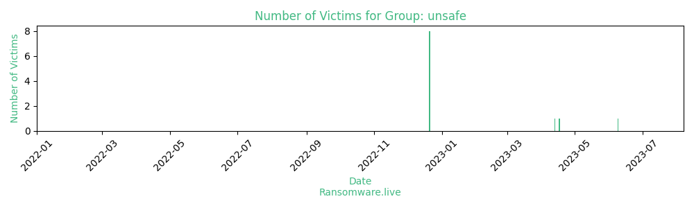

# Profiles for ransomware group : **unsafe**

> A group which seems to recycle leak from other ransomware groups

🔎 `ransomware.live`has an active  parser for indexing unsafe's victims

### URLs
| Title | Available | Last visit | fqdn | Screenshot 
|---|---|---|---|---|
| Home - UnSafeBlog | 🔴 | 25/07/2023 22:52 | `http://unsafeipw6wbkzzmj7yqp7bz6j7ivzynggmwxsm6u2wwfmfqrxqrrhyd.onion` | <a href="https://images.ransomware.live/screenshots/unsafeipw6wbkzzmj7yqp7bz6j7ivzynggmwxsm6u2wwfmfqrxqrrhyd-onion.png" target=_blank>📸</a> | 

### Total Attacks Over Time

### Posts

> 11 victims found

| post | date | Description | Screenshot | 
|---|---|---|---|
| [`TAG Aviation`](https://tagaviation.com) | 09/06/2023 |  country: CH - revenue: 326.60M |   |
| [`SPARTAN Light Metal Products Inc`](https://spartanlmp.com) | 17/04/2023 |  country: US - revenue: 311.00M |   |
| [`Invenergy`](https://invenergy.com) | 13/04/2023 |  country: US - revenue: 10 |   |
| [`G.R. Sponaugle`](https://grsponaugle.com) | 21/12/2022 |  country: US - revenue: 22.00M |   |
| [`Horwitz Horwitz & Associates`](https://www.horwitzlaw.com) | 21/12/2022 |  country: US - revenue: 8.00M |   |
| [`Wings Etc`](https://wingsetc.com) | 21/12/2022 |  country: US - revenue: 145.00M |   |
| [`Dooly County School System`](https://dooly.k12.ga.us) | 21/12/2022 |  country: US - revenue: 20.00M |   |
| [`Whatcom County Library System`](https://wcls.org) | 21/12/2022 |  country: US - revenue: 7.00M |   |
| [`The Chedi Muscat`](https://chedimuscat.com) | 21/12/2022 |  country: OM - revenue: 28.00M |   |
| [`Barakat Travel Co`](https://barakattravel.com) | 21/12/2022 |  country: LB - revenue: 5.00M |   |
| [`Ucar`](https://ucar.fr) | 21/12/2022 |  country: FR - revenue: 33.00M |   |

Last update : _Thursday 03/08/2023 07.07 (UTC)_
