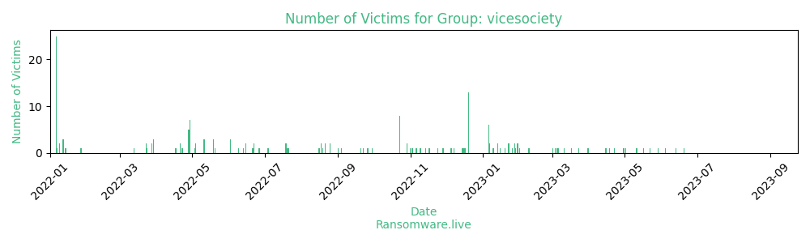

# Profiles for ransomware group : **vicesociety**

> Vice Society ransomware appends the .v-society extension when encrypting Linux machines. Running a leak site on the darkweb, Possible relations with "HelloKitty"

_`ecdmr42axxx.onion - fileserver`_

### External analysis
- v-society.official@onionmail.org

- ViceSociety@onionmail.org

- https://blog.talosintelligence.com/2021/08/vice-society-ransomware-printnightmare.html

🔎 `ransomware.live`has an active  parser for indexing vicesociety's victims

### URLs
| Title | Available | Last visit | fqdn | Screenshot 
|---|---|---|---|---|
| none | 🔴 | 01/05/2021 00:00 | `http://4hzyuotli6maqa4u.onion` | ❌ | 
| Vice Society - Official Site | 🟢 | 07/08/2023 10:55 | `http://vsociethok6sbprvevl4dlwbqrzyhxcxaqpvcqt5belwvsuxaxsutyad.onion` | <a href="https://images.ransomware.live/screenshots/vsociethok6sbprvevl4dlwbqrzyhxcxaqpvcqt5belwvsuxaxsutyad-onion.png" target=_blank>📸</a> | 
| there is nothing... | 🔴 | 21/09/2022 17:27 | `http://ecdmr42a34qovoph557zotkfvth4fsz56twvwgiylstjup4r5bpc4oad.onion` | ❌ | 
| Vice Society - Official Site | 🟢 | 07/08/2023 10:56 | `http://wmp2rvrkecyx72i3x7ejhyd3yr6fn5uqo7wfus7cz7qnwr6uzhcbrwad.onion` | <a href="https://images.ransomware.live/screenshots/wmp2rvrkecyx72i3x7ejhyd3yr6fn5uqo7wfus7cz7qnwr6uzhcbrwad-onion.png" target=_blank>📸</a> | 
| Vice Society - Official Site | 🟢 | 07/08/2023 10:57 | `http://ssq4zimieeanazkzc5ld4v5hdibi2nzwzdibfh5n5w4pw5mcik76lzyd.onion` | <a href="https://images.ransomware.live/screenshots/ssq4zimieeanazkzc5ld4v5hdibi2nzwzdibfh5n5w4pw5mcik76lzyd-onion.png" target=_blank>📸</a> | 
| Vice Society - Official Site | 🟢 | 07/08/2023 10:58 | `http://ml3mjpuhnmse4kjij7ggupenw34755y4uj7t742qf7jg5impt5ulhkid.onion` | <a href="https://images.ransomware.live/screenshots/ml3mjpuhnmse4kjij7ggupenw34755y4uj7t742qf7jg5impt5ulhkid-onion.png" target=_blank>📸</a> | 

### Ransom note
* [📝 1 ransom note](notes/vicesociety)

### Total Attacks Over Time

### Posts

> 187 victims found

| post | date | Description | Screenshot | 
|---|---|---|---|
| [`SSV Architects`](http://www.ssv-architekten.de/) | 20/06/2023 | Our office realizes a wide range of different construction tasks. We design buildings that are natural, individual and clearly designed. These include both new buildings and the majority of conversions of mostly listed buildings. |   |
| [`Bogleboo`](http://www.bogleboo.se/) | 13/06/2023 | Bogleboo develops and maintains customized systems in the fashion industry. We have many years of experience in IT solutions for the retail industry with a special focus on the fashion industry and an extensive knowledge of the specific processes in the area. |   |
| [`Nerim`](http://www.nerim.com/) | 04/06/2023 | Nerim is a full service operator fulfilling the full range of communications needs of SMBs and local government since 1999. Nerim offers broadband connectivity, enterprise telephony, server hosting and network security services. | <a href="https://images.ransomware.live/screenshots/posts/7cd7a9961beff4b644e7bec7ac4cc81a.png" target=_blank>📸</a> |
| [`Adsboll`](http://www.ads.dk/) | 29/05/2023 | Adsboll - is a national construction company. Nationwide, we are skilled in residential and commercial construction for both private and public clients, including housing associations. We have our own production of concrete, masonry and sewer work, which we carry out regionally in Kolding and the surrounding area.  |   |
| [`Cafpi`](http://www.cafpi.fr/) | 22/05/2023 | Cafpi is the undisputed leader of the profession it created: that of Mortgage Broker. Prominent in the mortgage market for nearly 4 decades, CAFPI has developed wide-ranging expertise, and a vast network of partners. |   |
| [`Aneka Tambang`](http://www.antam.com/) | 17/05/2023 | With operations spread throughout the mineral-rich Indonesian archipelago, ANTAM undertakes all activities from exploration, excavation, processing through to marketing of nickel ore, ferronickel, gold, silver, bauxite and coal. |   |
| [`DATALAN`](http://www.datalan.sk/) | 11/05/2023 | DATALAN is more than 220 experts who are united by strong know-how and enthusiasm for technology. We have been on the market for more than 30 years and are among the top Slovak technology companies. |   |
| [`Brighton Hill Community School`](http://www.brightonhill.hants.sch.uk/) | 02/05/2023 | Brighton Hill Community School is a coeducational secondary school located in Brighton Hill, Basingstoke in the county of Hampshire in the south of England. |   |
| [`CMC Group`](http://www.centurylabel.com/) | 30/04/2023 | Located in Bowling Green, Ohio, Century Label (a CMC Group company) has over 40 years of experience printing custom labels and packaging.  | <a href="https://images.ransomware.live/screenshots/posts/148efb5fb05b0bfe91cccbab8c47755f.png" target=_blank>📸</a> |
| [`Neptune Lines`](http://www.neptunelines.com/) | 22/04/2023 | It is Neptune Lines' mission to be the most trusted car carrier company in the areas we operate, always delivering flexible and tailor-made solutions to our client-partners by investing in our most valuable asset, our people.  |   |
| [`Lakeland Community College`](http://www.lakelandcc.edu/) | 18/04/2023 | Founded in 1967, Lakeland Community College was the first college in Ohio created by a vote of the people. True to our mission, Lakeland provides quality learning opportunities to meet the social and economic needs of the community. |   |
| [`CommScope`](http://www.commscope.com/) | 15/04/2023 | Founded in 1976, CommScope Holding provides infrastructure solutions for communications networks worldwide. We design, manufacture, install and support the hardware infrastructure and software intelligence that enable our digital society to interact and thrive. | <a href="https://images.ransomware.live/screenshots/posts/46a338d2b5a16c71608410ad883bf7b1.png" target=_blank>📸</a> |
| [`Lewis & Clark College`](http://www.lclark.edu/) | 31/03/2023 | Lewis & Clark is a private institution with a public conscience, a residential campus with global reach. Students and faculty throughout all three of Lewis & Clark's schools - the undergraduate College of Arts and Sciences, the Graduate School of Education and Counseling, and the School of Law - pursue new ways of knowing by combining classic liberal learning with pioneering collaboration. |   |
| [`Autoridad de Acueductos Y Alcantarillados`](http://www.acueductospr.com/) | 23/03/2023 | The Puerto Rico Aqueducts and Sewers Authority is a water company and the government-owned corporation responsible for water quality, management, and supply in Puerto Rico, a US insular area. | <a href="https://images.ransomware.live/screenshots/posts/a6abf531fe628d3a3678144555e8daa6.png" target=_blank>📸</a> |
| [`Ecolog International`](http://www.ecolog-international.com/) | 17/03/2023 | Ecolog International is a multinational company that uses technology and supply chain management to provide services for a variety of industries including energy, construction, facility management and the environment. |   |
| [`Berkeley County Schools`](http://www.berkeleycountyschools.org/) | 11/03/2023 | Berkeley County Public Schools oversees all operations of the public schools in the county of Berkeley, West Virginia. They serve over 19 722 students at 29 elementary, intermediate, middle and high schools. | <a href="https://images.ransomware.live/screenshots/posts/a3de3015ba22ed0eb7ad718bfe16ea6d.png" target=_blank>📸</a> |
| [`Kventa Kft`](http://www.kventa.hu/) | 06/03/2023 | Our company's main field of activity has been the trade of computing devices since the beginning. Today, our offer ranges from the installation of local networks and professional computer technology devices, through PC components to computer technology accessories, resulting in a range of several thousand products. | <a href="https://images.ransomware.live/screenshots/posts/31438348122a5242249fb0daa59ab162.png" target=_blank>📸</a> |
| [`HAW Hamburg`](http://www.haw-hamburg.de/) | 05/03/2023 | Developing sustainable solutions to the societal challenges of today and tomorrow. This is the goal of the Hamburg University of Applied Sciences (HAW Hamburg), northern Germany's leading applied sciences university when it comes to reflective practice. People from more than 100 countries help make HAW Hamburg what it is, and our diversity is our particular strength. | <a href="https://images.ransomware.live/screenshots/posts/5f588c7396b465c024e53e4b9ed1914f.png" target=_blank>📸</a> |
| [`HUNOSA`](http://www.hunosa.es/) | 03/03/2023 | We are a business group that transforms, like energy. After decades as a benchmark in a strategic sector such as coal, we have become a company focused on energy, energy services and the environment. |   |
| [`Vesuvius`](http://www.vesuvius.com/) | 01/03/2023 | Vesuvius provides engineering services and solutions principally to steel and foundry industries worldwide. With 17 research centres across the globe and an annual investment of 33.2 million in research and development, Vesuvius continues to lead innovation in our industry. |   |
| [`Mount Saint Mary College`](http://www.msmc.edu/) | 09/02/2023 | Mount Saint Mary College is a private Catholic college in Newburgh, New York. It was founded in 1959 by the Dominican Sisters. The campus overlooks the Hudson River, halfway between New York City and Albany. More than 2,700 men and women are enrolled in over 50 undergraduate programs and three graduate degree programs. |   |
| [`Guildford County School`](http://www.guildfordcounty.co.uk/) | 01/02/2023 | As a School founded in 1905 we have deep-rooted values and traditions which have resulted in consistent academic success and we have held a strong place within the Guildford Educational establishment for over 100 years. |   |
| [`TechInsights`](http://www.semiconductor.com/) | 31/01/2023 | For over 30 years we have existed to support a fair marketplace where semiconductor and electronics intellectual property can be innovated and monetized. |   |
| [`Societa Italiana Brevetti SpA`](http://www.sib.it/) | 31/01/2023 | We are a leading firm in intellectual property consultancy , specialized in the protection and defense of patents, trademarks, models, designs and copyrights, among the very first in terms of appreciation at an international level. |   |
| [`Okanagan College`](http://www.okanagan.bc.ca/) | 30/01/2023 | Established in 1963, Okanagan College has since grown to be the largest college in British Columbia outside the Lower Mainland and Victoria with over 8,500 full-time students on four regional campuses and is the second-largest trade school in British Columbia. Approximately 1,000 international students from over 40 countries currently study at Okanagan College. |   |
| [`Scheppersinstituut Wetteren`](http://www.scheppers-wetteren.be/) | 30/01/2023 | Scheppersinstituut Wetteren is a company that operates in the Education industry. The Scheppers Institute is one of the 6 schools for Secondary Education of the Friars of Scheppers in Flanders. |   |
| [`NPTC Group of Colleges`](http://www.nptcgroup.ac.uk/) | 29/01/2023 | NPTC Group of Colleges, formerly Neath Port Talbot College and Coleg Powys, is one of the largest Further Education providers in Wales covering 30 per cent of the country’s landmass. |   |
| [`Seguros Equinoccial`](http://www.segurosequinoccial.com/) | 28/01/2023 | Seguros Equinoccial was born in 1973 and since then it has been a leading company in the Ecuadorian market, always seeking to provide an excellent service to its clients and the most complete insurance solutions for individuals and companies. |   |
| [`EGR`](http://www.egr.at/) | 28/01/2023 | We have specialized in the sale of telecommunications and mobile communications products for over 25 years. Through cooperation with our renowned sales partners Magenta and Drei, we have advanced to become the most successful sales company in this sector in Austria. |   |
| [`Bristol Community College`](http://www.bristolcc.edu/) | 26/01/2023 | Bristol Community College is a comprehensive, public community college offering more than 130 career and transfer programs of study that lead to an associate degree in science, arts, applied sciences, and certificates of accomplishment or achievement.  |   |
| [`CloudCall`](http://www.cloudcall.com.au/) | 23/01/2023 | CloudCall aims to become the leading global provider of cloud solutions for small to medium businesses by simplifying their work life, taking care of their IT environment, and allowing them to focus on their core businesses. |   |
| [`emoney Home Loans`](http://www.emoneyhomeloans.com.au/) | 23/01/2023 | With over 25 years of expertise, we're the home for all borrowers. At emoney Home Loans, we know that no ones situation is the same and that when it comes to home loans, there's no one size fits all approach. |   |
| [`Monmouth College`](https://www.monmouthcollege.edu/) | 20/01/2023 | Monmouth College is a private Presbyterian liberal arts college in Monmouth, Illinois. Monmouth enrolls approximately 900 students from 21 countries who choose courses from 40 major programs, 43 minors, and 17 pre-professional programs in a core curriculum. |   |
| [`University of Duisburg-Essen`](https://www.uni-due.de/) | 16/01/2023 | With its 12 departments and around 40,000 students, the University of Duisburg-Essen is among the 10 largest German universities. Since 2014, research income has risen by 150 percent. Natural science and engineering are ranked within the top 10 in Germany, and the humanities are within the top 20 to 30. Especially, the physics field is ranked in the top 1 in Germany. |   |
| [`TIMco`](https://www.timco.co.uk/) | 14/01/2023 | TIMCO is a supplier of essential products that trade professionals rely on every day. Over 7,000 quality products across all essential categories. |   |
| [`Central Texas College`](https://www.ctcd.edu/) | 14/01/2023 | We offer a comprehensive array of associate degrees, career and technical training, and adult continuing education in delivery formats that address virtually every need. Our tuition rate is among the lowest in the country. |   |
| [`Fire Rescue Victoria`](https://www.frv.vic.gov.au) | 10/01/2023 | Fire Rescue Victoria is a fire and rescue service in the state of Victoria, Australia, that provides firefighting, rescue, HAZMAT and Emergency Medical Response services in areas of metropolitan Melbourne and major regional centres throughout Victoria. |   |
| [`Duty Free Philippines`](https://www.dfp.com.ph/) | 07/01/2023 | Duty Free Philippines - In the service of Philippine Tourism. As a government corporation, DFPC is tasked to operate the duty-and tax-free merchandising system in the Philippines to augment the service facilities for tourists and to generate foreign exchange and revenue for the government. |   |
| [`Swift Academies`](https://www.swiftacademies.org.uk/) | 07/01/2023 | The aim of the Swift Academies is to build, strengthen and expand our Trust across the North of England, by incorporating good and outstanding schools into our family of academies and acting as a sponsor for other primary and secondary academies, aiming to help them improve their standards and performance. |   |
| [`Park View`](https://www.parkview.haringey.sch.uk/) | 06/01/2023 | Park View is a high performing community school in Tottenham, north London where your child will aspire, achieve and succeed. |   |
| [`Bay Area Rapid Transit`](https://www.bart.gov/) | 06/01/2023 | The San Francisco Bay Area Rapid Transit District is a heavy-rail public transit system that connects the San Francisco Peninsula with communities in the East Bay and South Bay. BART operates in five counties with 131 miles of track and 50 stations, carrying approximately 405,000 trips on an average weekday. |   |
| [`City Lit`](https://www.citylit.ac.uk/) | 06/01/2023 | Whether you are looking to kick-start a new career, delve into a favourite topic, keep active or bring some balance to a busy life, City Lit offer a huge range of courses. |   |
| [`PROQUINAL Spradling Group`](https://www.proquinal.com/) | 06/01/2023 | A team of over 1,800 people who work every day with the desire to inspire the world with designs that move people, innovations that are lasting, and products that make spaces more attractive. Always with the commitment of caring for the environment and communities we're a part of. We are Spradling: Inspiration that covers the world. |   |
| [`Sub-drill Supply`](https://www.sub-drill.com/) | 06/01/2023 | Sub-drill was incorporated in 1992 and is a proven and trusted manufacturer and supplier of Subsea Tools and Drilling Equipment to the Global Energy Industry. |   |
| [`LetMeRepair`](https://www.letmerepair.com/) | 06/01/2023 | We are company focusing on supporting the complete, "presales" and "after sales cycles" for the IT, office automation, consumer Electronics and telecommunication, robotics and electromobility industries. LetMeRepair has set its goal to be the most efficient service company while achieving the highest possible customer satisfaction. |   |
| [`FREDERICK Public Schools`](https://google.com/search?q=FREDERICK+Public+Schools) | 20/12/2022 | Our Mission: To provide a caring and creative environment that promotes excellence, fosters integrity, and empowers, inspires, and encourages each student to reach his or her full academic, extracurricular, and social potential. |   |
| [`McNamara & Thiel Insurance Agency`](https://google.com/search?q=McNamara+%26+Thiel+Insurance+Agency) | 20/12/2022 | Established in 1974, McNamara & Thiel has been one of the leading full-service, independent agencies in Fond du Lac and the surrounding areas. Our combined experience of over 41 years focuses on service to our clients and community. |   |
| [`JEALSA`](https://google.com/search?q=JEALSA) | 20/12/2022 | Jealsa is a family business based in Galicia and founded in 1958 with its central headquarters located in Boiro (La Coruña – Spain). We are dedicated to manufacturing and distribution of canned seafood and fish. |   |
| [`Communications Solutions Company`](https://google.com/search?q=Communications+Solutions+Company) | 20/12/2022 | Ltd (CSC) is a Saudi Arabian Company based in Riyadh. CSC is a leading company in Telecommunication & Networking field services. CSC is accredited by STC, ACWA Power, MOFA, SEC, GASCO, Mobily, Zain, SWCC, KJO, Siemens, Nokia, Ericsson and Saudi Aramco. |   |
| [`Priority Building Services, LLC`](https://google.com/search?q=Priority+Building+Services%2C+LLC) | 20/12/2022 | Over three decades of combined experience in managing the janitorial maintenance programs of some of the most prominent Fortune 500 companies has made Priority Building Services one of the most experienced facility services firms in the industry. |   |
| [`Waikato District Health Board`](https://google.com/search?q=Waikato+District+Health+Board) | 20/12/2022 | The Waikato District Health Board is a district health board with the focus on providing healthcare to the Waikato region of New Zealand. |   |
| [`Whitehouse Independent School District`](https://google.com/search?q=Whitehouse+Independent+School+District) | 20/12/2022 | The mission of Whitehouse ISD, the standard of excellence, is to inspire and equip students through innovative and challenging opportunities. |   |
| [`SparJames Hall & CompanyHeron and Brearley`](https://google.com/search?q=SparJames+Hall+%26+CompanyHeron+and+Brearley) | 20/12/2022 | Heron & Brearley and its related group of companies is a major employer in the Isle of Man, as well as a leader in the Island's hospitality industry. From managed houses to convenience stores and forecourts we offer an impressive array of services to a diverse range of customers, both on-Island and in the UK. |   |
| [`Higher School of the Public Ministry of the Union`](https://google.com/search?q=Higher+School+of+the+Public+Ministry+of+the+Union) | 20/12/2022 | The mission of the ESMPU is to facilitate the continuous improvement of the members and servants of the Public Prosecutor's Office for an effective professional performance. |   |
| [`San Luis Coastal Unified School District`](https://google.com/search?q=San+Luis+Coastal+Unified+School+District) | 20/12/2022 | Small neighborhood schools are a hallmark of the District where students are educated from preschool through twelfth grade and a world-class adult school program offers unique, life-improving courses to thousands of community members. |   |
| [`Consejo Superior de Investigaciones Cientificas`](https://google.com/search?q=Consejo+Superior+de+Investigaciones+Cientificas) | 20/12/2022 | The Higher Council for Scientific Research (CSIC) is the largest public institution in Spain dedicated to scientific and technical research and one of the most prominent in the European Research Area. |   |
| [`Family Medicine CentersFMC Clinics`](https://google.com/search?q=Family+Medicine+CentersFMC+Clinics) | 20/12/2022 | Family Medicine Centers are the area's leading provider of family medical care. Our board-certified physicians use the latest technology to provide your family with the highest level of care. |   |
| [`Xavier University of Louisiana`](https://google.com/search?q=Xavier+University+of+Louisiana) | 20/12/2022 | Xavier University of Louisiana, founded by Saint Katharine Drexel and the Sisters of the Blessed Sacrament, is Catholic and historically Black. The ultimate purpose of the University is to contribute to the promotion of a more just and humane society by preparing its students to assume roles of leadership and service in a global society. |   |
| [`University Institute of Technology of Paris`](https://google.com/search?q=University+Institute+of+Technology+of+Paris) | 17/12/2022 | The University Institute of Technology (IUT) of Paris - Rives de Seine welcomes 3,000 students each year from a wide variety of backgrounds, ranging from recent high school graduates, holders of a higher education diploma and students engaged in continuing education. All our students share a common goal founded on professionalization, academic innovation and educational quality. |   |
| [`Publicare`](https://google.com/search?q=Publicare) | 16/12/2022 |   |   |
| [`Universidade Catolica Portuguesa`](https://google.com/search?q=Universidade+Catolica+Portuguesa) | 15/12/2022 |   |   |
| [`New Partners`](https://google.com/search?q=New+Partners) | 08/12/2022 |   |   |
| [`Feu Vert`](https://google.com/search?q=Feu+Vert) | 06/12/2022 |   |   |
| [`Glutz`](https://google.com/search?q=Glutz) | 05/12/2022 |   |   |
| [`Plascar Participacoes Industriais`](https://google.com/search?q=Plascar+Participacoes+Industriais) | 29/11/2022 |   |   |
| [`IKEA MoroccoIKEA Kuwait`](https://google.com/search?q=IKEA+MoroccoIKEA+Kuwait) | 28/11/2022 | We believe that no matter what we do in life, we should always try to be the absolute best at it. At IKEA we focus on being the best at ordinary everyday things. Because to us, the ordinary everyday contains the best of life. We want to be Extraordinary at the ordinary for you. |   |
| [`Cincinnati State`](https://google.com/search?q=Cincinnati+State) | 24/11/2022 |   |   |
| [`Institute of Science and Technology Austria`](https://google.com/search?q=Institute+of+Science+and+Technology+Austria) | 17/11/2022 |   |   |
| [`Baysgarth School`](https://google.com/search?q=Baysgarth+School) | 14/11/2022 |   |   |
| [`Kreisverwaltung Rhein-Pfalz-Kreis`](https://google.com/search?q=Kreisverwaltung+Rhein-Pfalz-Kreis) | 10/11/2022 |   |   |
| [`Hartnell College`](https://google.com/search?q=Hartnell+College) | 09/11/2022 |   |   |
| [`CR&R Environmental Services`](https://google.com/search?q=CR%26R+Environmental+Services) | 06/11/2022 |   |   |
| [`YMCA of Metropolitan Washington`](https://google.com/search?q=YMCA+of+Metropolitan+Washington) | 03/11/2022 |   |   |
| [`Unidad Medica Angloamericana`](https://google.com/search?q=Unidad+Medica+Angloamericana) | 02/11/2022 |   |   |
| [`Rooks Heath School`](https://google.com/search?q=Rooks+Heath+School) | 01/11/2022 |   |   |
| [`The Bishop of Hereford's Bluecoat School`](https://google.com/search?q=The+Bishop+of+Hereford%27s+Bluecoat+School) | 29/10/2022 |   |   |
| [`Kujalleq Municipality`](https://google.com/search?q=Kujalleq+Municipality) | 29/10/2022 |   |   |
| [`Grupo Jaime Camara`](https://google.com/search?q=Grupo+Jaime+Camara) | 23/10/2022 |   |   |
| [`TMShipping`](https://google.com/search?q=TMShipping) | 23/10/2022 |   |   |
| [`HALYVOURGIKI.S.A.`](https://google.com/search?q=HALYVOURGIKI.S.A.) | 23/10/2022 |   |   |
| [`Marist College Ashgrove`](https://google.com/search?q=Marist+College+Ashgrove) | 23/10/2022 |   |   |
| [`Pate's Grammar School`](https://google.com/search?q=Pate%27s+Grammar+School) | 23/10/2022 |   |   |
| [`Test Valley School`](https://google.com/search?q=Test+Valley+School) | 23/10/2022 |   |   |
| [`Mars Area School District`](https://google.com/search?q=Mars+Area+School+District) | 23/10/2022 |   |   |
| [`Maternite des Bluets`](https://google.com/search?q=Maternite+des+Bluets) | 23/10/2022 |   |   |
| [`Los Angeles Unified School District`](https://google.com/search?q=Los+Angeles+Unified+School+District) | 30/09/2022 |   |   |
| [`Samuel Ryder Academy`](https://google.com/search?q=Samuel+Ryder+Academy) | 26/09/2022 |   |   |
| [`School of Oriental African Studies`](https://google.com/search?q=School+of+Oriental+African+Studies) | 22/09/2022 |   |   |
| [`Sierra College`](https://google.com/search?q=Sierra+College) | 20/09/2022 |   |   |
| [`Elmbrook Schools`](https://google.com/search?q=Elmbrook+Schools) | 04/09/2022 |   |   |
| [`Moon Area School District`](https://google.com/search?q=Moon+Area+School+District) | 01/09/2022 |   |   |
| [`Lampton School`](https://google.com/search?q=Lampton+School) | 25/08/2022 |   |   |
| [`Frances King School of English`](https://google.com/search?q=Frances+King+School+of+English) | 25/08/2022 |   |   |
| [`Family Medicine Centers`](https://google.com/search?q=Family+Medicine+Centers) | 21/08/2022 |   |   |
| [`BSA Hospice of the Southwest`](https://google.com/search?q=BSA+Hospice+of+the+Southwest) | 21/08/2022 |   |   |
| [`PROSOL`](https://google.com/search?q=PROSOL) | 19/08/2022 |   |   |
| [`Department of Indre-et-Loire`](https://google.com/search?q=Department+of+Indre-et-Loire) | 18/08/2022 |   |   |
| [`Consejo Superior de`](https://google.com/search?q=Consejo+Superior+de) | 18/08/2022 |   |   |
| [`Vygon Spain`](https://google.com/search?q=Vygon+Spain) | 16/08/2022 |   |   |
| [`CHDE POLSKA`](https://google.com/search?q=CHDE+POLSKA) | 21/07/2022 |   |   |
| [`Edenfield`](https://google.com/search?q=Edenfield) | 20/07/2022 |   |   |
| [`XQUADRAT GmbH`](https://google.com/search?q=XQUADRAT+GmbH) | 19/07/2022 |   |   |
| [`San Luis Coastal Unified`](https://google.com/search?q=San+Luis+Coastal+Unified) | 19/07/2022 |   |   |
| [`Vectalia group`](https://google.com/search?q=Vectalia+group) | 04/07/2022 |   |   |
| [`Ministry of Agriculture Rebublic Indonesia`](https://google.com/search?q=Ministry+of+Agriculture+Rebublic+Indonesia) | 27/06/2022 | Indonesia's rich natural resources are influenced by its tropical climate and geographical location between two continents, Asia and Australia, and two oceans, the Pacific Ocean and the Indian Ocean. Therefore, Indonesia is known as an agrarian country with a variety of products from agriculture, plantations, livestock, fisheries and forestry. |   |
| [`Medical University of Innsbruck`](https://google.com/search?q=Medical+University+of+Innsbruck) | 26/06/2022 |   |   |
| [`PT Astra Honda Motor`](https://google.com/search?q=PT+Astra+Honda+Motor) | 22/06/2022 |   |   |
| [`Pilton Community College`](https://google.com/search?q=Pilton+Community+College) | 22/06/2022 |   |   |
| [`Ospedale Macedonio Melloni`](https://google.com/search?q=Ospedale+Macedonio+Melloni) | 21/06/2022 |   |   |
| [`Novelty Group`](https://google.com/search?q=Novelty+Group) | 15/06/2022 |   |   |
| [`Magnum`](https://google.com/search?q=Magnum) | 15/06/2022 |   |   |
| [`Grand Valley State University`](https://google.com/search?q=Grand+Valley+State+University) | 13/06/2022 |   |   |
| [`Palermo`](https://google.com/search?q=Palermo) | 09/06/2022 |   |   |
| [`St Paul`](https://google.com/search?q=St+Paul) | 02/06/2022 |   |   |
| [`Acorn Recruitment`](https://google.com/search?q=Acorn+Recruitment) | 02/06/2022 |   |   |
| [`The De Montfort School`](https://google.com/search?q=The+De+Montfort+School) | 02/06/2022 |   |   |
| [`The Catholic Foundation`](https://google.com/search?q=The+Catholic+Foundation) | 20/05/2022 |   |   |
| [`Atlanta Perinatal Associates`](https://google.com/search?q=Atlanta+Perinatal+Associates) | 19/05/2022 |   |   |
| [`Carmel College`](https://google.com/search?q=Carmel+College) | 19/05/2022 |   |   |
| [`Higher School of the Public`](https://google.com/search?q=Higher+School+of+the+Public) | 19/05/2022 |   |   |
| [`Trans Technology Pte Ltd.`](https://google.com/search?q=Trans+Technology+Pte+Ltd.) | 11/05/2022 |   |   |
| [`Caldes de Montbui`](https://google.com/search?q=Caldes+de+Montbui) | 11/05/2022 |   |   |
| [`Salud Total`](https://google.com/search?q=Salud+Total) | 11/05/2022 |   |   |
| [`ELTA Hellenic Post`](https://google.com/search?q=ELTA+Hellenic+Post) | 04/05/2022 |   |   |
| [`Haynes Manuals`](https://google.com/search?q=Haynes+Manuals) | 04/05/2022 |   |   |
| [`Asia Pacific University`](https://google.com/search?q=Asia+Pacific+University) | 03/05/2022 |   |   |
| [`Mercadocar Mercantil Ltda.`](https://google.com/search?q=Mercadocar+Mercantil+Ltda.) | 29/04/2022 |   |   |
| [`Suhl. City in Germany`](https://google.com/search?q=Suhl.+City+in+Germany) | 29/04/2022 |   |   |
| [`Associazione Bancaria Italiana`](https://google.com/search?q=Associazione+Bancaria+Italiana) | 29/04/2022 |   |   |
| [`Domingues and Pinho Contadores`](https://google.com/search?q=Domingues+and+Pinho+Contadores) | 29/04/2022 |   |   |
| [`Building Plastics, Inc.`](https://google.com/search?q=Building+Plastics%2C+Inc.) | 29/04/2022 |   |   |
| [`Fonseca Supermarkets`](https://google.com/search?q=Fonseca+Supermarkets) | 29/04/2022 |   |   |
| [`GOLDENDUCK GROUP`](https://google.com/search?q=GOLDENDUCK+GROUP) | 29/04/2022 |   |   |
| [`Levantina, Ingenieria y Construccion`](https://google.com/search?q=Levantina%2C+Ingenieria+y+Construccion) | 28/04/2022 |   |   |
| [`Stratton Finance`](https://google.com/search?q=Stratton+Finance) | 28/04/2022 |   |   |
| [`Est Ensemble`](https://google.com/search?q=Est+Ensemble) | 28/04/2022 |   |   |
| [`CORFERIAS`](https://google.com/search?q=CORFERIAS) | 28/04/2022 |   |   |
| [`ALMANIE GROUP`](https://google.com/search?q=ALMANIE+GROUP) | 28/04/2022 |   |   |
| [`Mossbourne Federation`](https://google.com/search?q=Mossbourne+Federation) | 23/04/2022 |   |   |
| [`Centre Hospitalier de Castelluccio`](https://google.com/search?q=Centre+Hospitalier+de+Castelluccio) | 22/04/2022 |   |   |
| [`Small Industries DevelopmentBank of India`](https://google.com/search?q=Small+Industries+DevelopmentBank+of+India) | 21/04/2022 | Small Industries Development Bank of India is the apex regulatory body for overall licensing and regulation of micro, small and medium enterprise finance companies in India. It is under the jurisdiction of Ministry of Finance, Government of India headquartered at Lucknow and having its offices all over the country. |   |
| [`Maristes Hermitage`](https://google.com/search?q=Maristes+Hermitage) | 21/04/2022 |   |   |
| [`NuLife Med`](https://google.com/search?q=NuLife+Med) | 17/04/2022 |   |   |
| [`APSM Systems`](https://google.com/search?q=APSM+Systems) | 29/03/2022 |   |   |
| [`ASPIRO`](https://google.com/search?q=ASPIRO) | 29/03/2022 |   |   |
| [`Ciments Guyanais`](https://google.com/search?q=Ciments+Guyanais) | 29/03/2022 |   |   |
| [`OSSEG Obra Social del Seguro`](https://google.com/search?q=OSSEG+Obra+Social+del+Seguro) | 28/03/2022 |   |   |
| [`Jammal Trust Bank`](https://google.com/search?q=Jammal+Trust+Bank) | 28/03/2022 |   |   |
| [`Establishment of the Agency for the Environmental Protection of the Marche Region`](https://google.com/search?q=Establishment+of+the+Agency+for+the+Environmental+Protection+of+the+Marche+Region) | 24/03/2022 |   |   |
| [`ICEHOTEL`](https://google.com/search?q=ICEHOTEL) | 23/03/2022 |   |   |
| [`Griggsville-Perry High School`](https://google.com/search?q=Griggsville-Perry+High+School) | 23/03/2022 |   |   |
| [`SENADO Argentina`](https://google.com/search?q=SENADO+Argentina) | 13/03/2022 |   |   |
| [`Optionis`](https://google.com/search?q=Optionis) | 27/01/2022 |   |   |
| [`Butler County Community College`](https://google.com/search?q=Butler+County+Community+College) | 14/01/2022 |   |   |
| [`Durham Cathedral Schools Foundation`](https://google.com/search?q=Durham+Cathedral+Schools+Foundation) | 12/01/2022 |   |   |
| [`Butler Community College`](https://google.com/search?q=Butler+Community+College) | 12/01/2022 |   |   |
| [`XAL`](https://google.com/search?q=XAL) | 12/01/2022 |   |   |
| [`SAVANNAH State University`](https://google.com/search?q=SAVANNAH+State+University) | 09/01/2022 |   |   |
| [`Carthage R-9 School District`](https://google.com/search?q=Carthage+R-9+School+District) | 09/01/2022 |   |   |
| [`Amaveca Salud`](https://google.com/search?q=Amaveca+Salud) | 07/01/2022 |   |   |
| [`Rolle`](https://google.com/search?q=Rolle) | 06/01/2022 |   |   |
| [`Alliance COAL, LLC`](https://google.com/search?q=Alliance+COAL%2C+LLC) | 06/01/2022 |   |   |
| [`Whitehouse`](https://google.com/search?q=Whitehouse) | 06/01/2022 |   |   |
| [`FILGO`](https://google.com/search?q=FILGO) | 06/01/2022 |   |   |
| [`Walter's Automotive Group`](https://google.com/search?q=Walter%27s+Automotive+Group) | 06/01/2022 |   |   |
| [`Gateway College`](https://google.com/search?q=Gateway+College) | 06/01/2022 |   |   |
| [`Centre Hospitalier D'Arles`](https://google.com/search?q=Centre+Hospitalier+D%27Arles) | 06/01/2022 |   |   |
| [`3V Sigma`](https://google.com/search?q=3V+Sigma) | 06/01/2022 |   |   |
| [`Eskenazi Health Foundation`](https://google.com/search?q=Eskenazi+Health+Foundation) | 06/01/2022 |   |   |
| [`Butali`](https://google.com/search?q=Butali) | 06/01/2022 |   |   |
| [`Plastipak Holdings, Inc.`](https://google.com/search?q=Plastipak+Holdings%2C+Inc.) | 06/01/2022 |   |   |
| [`Barlow Respiratory Hospital`](https://google.com/search?q=Barlow+Respiratory+Hospital) | 06/01/2022 |   |   |
| [`ROC Mondriaan`](https://google.com/search?q=ROC+Mondriaan) | 06/01/2022 |   |   |
| [`United Health Centers`](https://google.com/search?q=United+Health+Centers) | 06/01/2022 |   |   |
| [`KESSEL AG`](https://google.com/search?q=KESSEL+AG) | 06/01/2022 |   |   |
| [`Karl Bachl GmbH & Co.KG`](https://google.com/search?q=Karl+Bachl+GmbH+%26+Co.KG) | 06/01/2022 |   |   |
| [`SRH Holding`](https://google.com/search?q=SRH+Holding) | 06/01/2022 |   |   |
| [`Manhasset Union Free School District`](https://google.com/search?q=Manhasset+Union+Free+School+District) | 06/01/2022 |   |   |
| [`Lufkin Independent School District`](https://google.com/search?q=Lufkin+Independent+School+District) | 06/01/2022 |   |   |
| [`City of Witten`](https://google.com/search?q=City+of+Witten) | 06/01/2022 |   |   |
| [`Holy Family RC & CE College`](https://google.com/search?q=Holy+Family+RC+%26+CE+College) | 06/01/2022 |   |   |
| [`Hawthorn The Community Pub Co.`](https://google.com/search?q=Hawthorn+The+Community+Pub+Co.) | 06/01/2022 |   |   |
| [`Pontificia Universidad Javeriana`](https://google.com/search?q=Pontificia+Universidad+Javeriana) | 06/01/2022 |   |   |
| [`DFL`](https://google.com/search?q=DFL) | 06/01/2022 |   |   |
| [`Spar`](https://google.com/search?q=Spar) | 06/01/2022 |   |   |
| [`OSSEG Obra Social de Seguros`](https://google.com/search?q=OSSEG+Obra+Social+de+Seguros) | 01/01/2022 |   |   |
| [`Universidade Federal de Sao Paulo`](https://google.com/search?q=Universidade+Federal+de+Sao+Paulo) | 01/01/2022 |   |   |

Last update : _Monday 07/08/2023 12.13 (UTC)_
