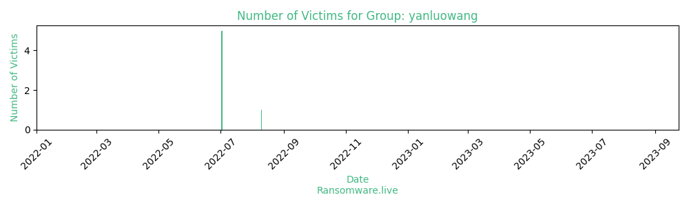

# Profiles for ransomware group : **yanluowang**

> According to PCrisk, Yanluowang is ransomware that encrypts (and renames) files, ends all running processes, stops services, and creates the README.txt file containing a ransom note. It appends the .yanluowang extension to filenames. Cybercriminals behind Yanluowang are targeting enterprise entities and organizations in the financial sector.Files encrypted by Yanluowang can be decrypted with this tool (it is possible to decrypt all files if the original file is larger than 3GB. If the original file is smaller than 3GB, then only smaller files can be decrypted).

### External analysis
- https://blog.talosintelligence.com/2022/08/recent-cyber-attack.html

- https://de.darktrace.com/blog/inside-the-yanluowang-leak-organization-members-and-tactics

- https://github.com/albertzsigovits/malware-notes/tree/master/Ransomware-Windows-Yanluowang

- https://securelist.com/how-to-recover-files-encrypted-by-yanlouwang/106332/

- https://symantec-enterprise-blogs.security.com/blogs/threat-intelligence/yanluowang-targeted-ransomware

- https://therecord.media/the-yanluowang-ransomware-group-in-their-own-words/

- https://twitter.com/CryptoInsane/status/1586967110504398853

- https://www.bleepingcomputer.com/news/security/free-decryptor-released-for-yanluowang-ransomware-victims/

- https://www.symantec.broadcom.com/hubfs/SED/SED_Threat_Hunter_Reports_Alerts/SED_FY22Q2_SES_Ransomware-Threat-Landscape_WP.pdf

### URLs
| Title | Available | Last visit | fqdn | Screenshot 
|---|---|---|---|---|
| Yanluowang | 🔴 | 01/11/2022 16:59 | `http://jukswsxbh3jsxuddvidrjdvwuohtsy4kxg2axbppiyclomt2qciyfoad.onion` | ❌ | 

### Ransom note
* [📝 1 ransom note](notes/yanluowang)

### Total Attacks Over Time

### Victims

> 6 victims found

| victim | date | Description | Screenshot | 
|---|---|---|---|
| [`Hot news straight from Cisco`](https://google.com/search?q=Hot+news+straight+from+Cisco) | 10/08/2022 |   |   |
| [`Shorr.com leakage`](https://google.com/search?q=Shorr.com+leakage) | 02/07/2022 |   |   |
| [`Greetings to havi.com and tmsw.com`](https://google.com/search?q=Greetings+to+havi.com+and+tmsw.com) | 02/07/2022 |   |   |
| [`Big data dump from various organizations`](https://google.com/search?q=Big+data+dump+from+various+organizations) | 02/07/2022 |   |   |
| [`Walmart was encrypted`](https://google.com/search?q=Walmart+was+encrypted) | 02/07/2022 |   |   |
| [`Cincinnati bell didn’t pay the ransom`](https://google.com/search?q=Cincinnati+bell+didn%E2%80%99t+pay+the+ransom) | 02/07/2022 |   |   |

Last update : _Sunday 24/09/2023 14.39 (UTC)_
